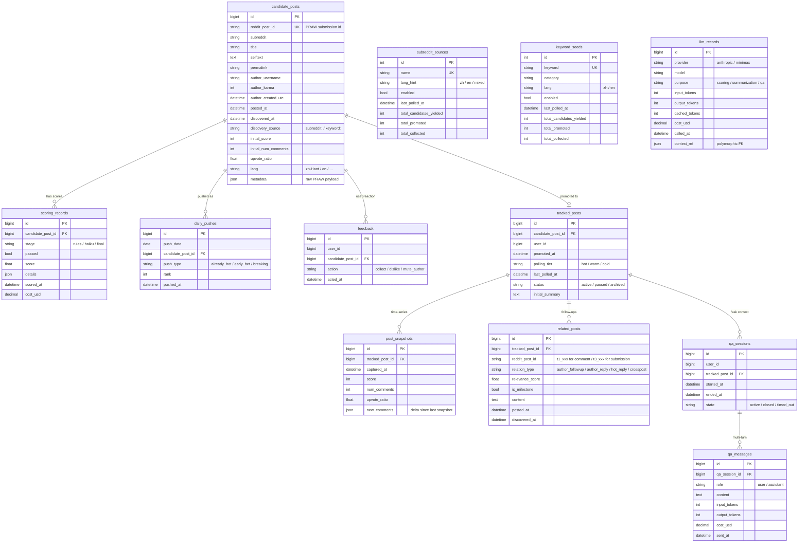

# v4 Schema — Reddit Tracker

> 對應 SCHEDULE.md M2.1。12 張表，分四群：探索 / 評分推送 / 收藏追蹤 / LLM 與問答。
> 與 v3 schema 大架構相同，差別在 Reddit 化的欄位名與 `related_posts.relation_type` 多了 `crosspost`。

---

## 表分群

| 群組 | 表 | 用途 |
|------|----|----|
| 探索 | `candidate_posts`、`subreddit_sources`、`keyword_seeds` | M2 |
| 評分推送 | `scoring_records`、`daily_pushes`、`feedback` | M3 + M4 |
| 收藏追蹤 | `tracked_posts`、`post_snapshots`、`related_posts` | M5 |
| LLM 與問答 | `llm_records`、`qa_sessions`、`qa_messages` | M3 + M6 |

---

## ER 圖（mermaid）

---

## 設計筆記

### 沿用 v3 的決定（PROGRESS.md gotcha 第 99–108 行）

- **BigInt PK 在 SQLite 不會 auto-increment** → 統一用 `BigInteger().with_variant(Integer(), "sqlite")`
- **JSON 欄位**：直接用 SQLAlchemy `JSON` type，Postgres 自動 JSONB、SQLite 自動 TEXT。
  v3 的自訂 `JSONField` + alembic mako import 那個坑直接避開。
- **timestamps**：全部 `DateTime(timezone=True)`，存 UTC tz-aware。
- **LLMSummary**：v3 把 evolution JSON 塞 `content` 字串裡。v4 沿用，所以 schema 不開 `evolution_summaries` 表，
  在 `llm_records` 內用 `purpose='summarization'` + `context_ref` 反查。

### v4 新增 / 改名

- `candidate_posts`：`thread_id` → `reddit_post_id`、新增 `subreddit` / `author_karma` / `upvote_ratio` / `lang`
- `related_posts.relation_type`：新增 `crosspost`（v3 沒有，是 Reddit `submission.duplicates()` 的產物）
- `subreddit_sources`：v3 沒這張表（Threads 時期 keyword 是唯一 source）

### 索引（M2.3 migration 中建立）

| 表 | 索引 | 理由 |
|----|------|------|
| `candidate_posts` | `(reddit_post_id)` UNIQUE | 去重 |
| `candidate_posts` | `(discovered_at)` | discovery job 排序 |
| `candidate_posts` | `(subreddit, posted_at)` | per-sub 統計 |
| `scoring_records` | `(candidate_post_id, stage)` | 取最新 verdict |
| `daily_pushes` | `(push_date, rank)` | 每日 Top 5 查詢 |
| `tracked_posts` | `(polling_tier, last_polled_at)` | 分級輪詢調度 |
| `related_posts` | `(tracked_post_id, relation_type)` | 後續事件查詢 |
| `subreddit_sources` | `(name)` UNIQUE | seeds loader idempotent |
| `keyword_seeds` | `(keyword)` UNIQUE | seeds loader idempotent |
